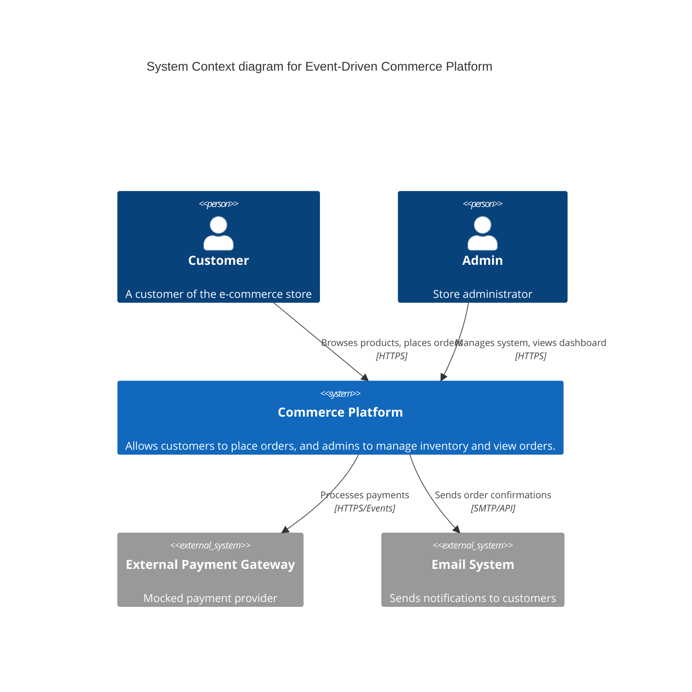
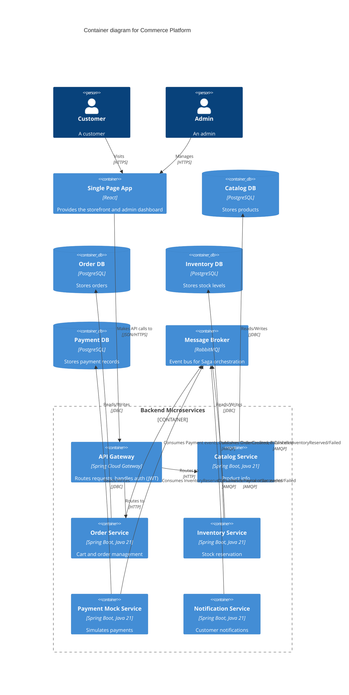
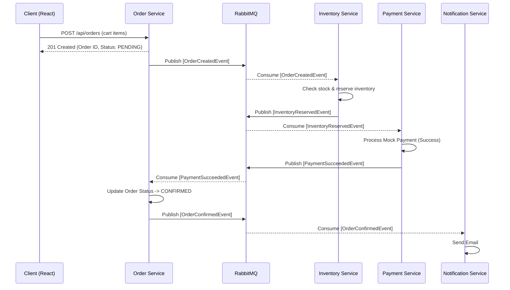
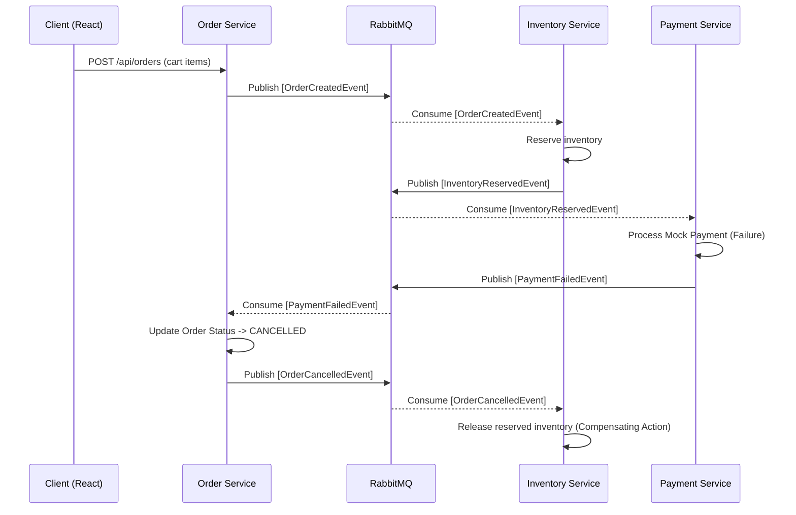
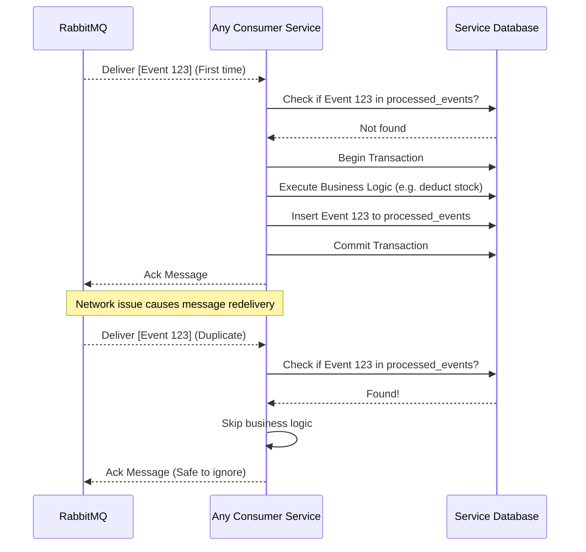

# Architecture & Saga Orchestration

## 1. C4 Context Diagram

## 2. C4 Container Diagram

## 3. Sequence Diagrams (Saga Pattern)

### A. Happy-Path Order Flow

### B. Payment-Failure Rollback Flow (Compensating Transaction)

### C. Duplicate-Event Idempotency Flow

